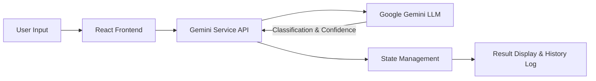

[](https://react.dev)
[](https://www.typescriptlang.org/)
[](https://vitejs.dev/)
[]()
[]()

# 🛡️ Spam-vs-Ham Classifier

### Real-Time SMS Classification · React · Google Gemini AI

*A modern web application that leverages Large Language Models (LLMs) to classify incoming SMS messages as spam or legitimate (ham) with high accuracy.*

---

## 📋 Table of Contents

- [🚀 What This Project Does](#-what-this-project-does)
- [🏗️ Architecture](#%EF%B8%8F-architecture)
- [✨ Key Features](#-key-features)
- [📁 Project Structure](#-project-structure)
- [⚡ Quick Start](#-quick-start)
- [📦 Dependencies](#-dependencies)

---

## 🚀 What This Project Does

Traditional spam classifiers rely on Naive Bayes or simple TF-IDF heuristics. This project takes a modern approach by utilizing the **Google Gemini API** for semantic analysis of text messages. Wrapped in a sleek, responsive React frontend, users can instantly determine if a message is a phishing attempt, a promotional blast, or a genuine conversation.



---

## 🏗️ Architecture

### 1. Frontend Layer (React + TypeScript)
- Built with **Vite** for blazing fast HMR and optimized production builds.
- Heavily typed with **TypeScript** to ensure robust state management and API contract adherence.
- Component-driven design separating the `InputForm`, `ResultDisplay`, and `HistoryLog`.

### 2. Service Layer (API Integration)
- Connects asynchronously to the Google Gemini endpoint via `geminiService.ts`.
- Manages loading states, error boundaries, and rate-limit handling seamlessly.
- Returns structured JSON data parsing the model's textual analysis into a structured `ClassificationResult`.

---

## ✨ Key Features

- **🧠 Deep Semantic Understanding:** Uses LLMs rather than simple regex, allowing the model to understand context and novel phishing tactics.
- **📱 Responsive UI:** Features a glassmorphic, mobile-first design using Tailwind CSS.
- **📜 History Tracking:** Automatically logs your queries in a persistent local session state for easy review.
- **🔗 Native Sharing:** Utilizes the Web Share API to easily forward classification results to others.

---

## 📁 Project Structure

```text
Spam-vs-Ham/
├── src/
│   ├── components/       # UI Components (InputForm, HistoryLog, etc.)
│   ├── services/         # geminiService.ts (API integration)
│   ├── types.ts          # TypeScript interfaces
│   ├── App.tsx           # Main application container
│   └── index.css         # Tailwind configurations
├── package.json          # Node dependencies
├── vite.config.ts        # Bundler configuration
└── README.md             # This documentation
```

---

## ⚡ Quick Start

### 1️⃣ Clone & Setup

```bash
git clone https://github.com/MedhaMasanam/Spam-vs-Ham.git
cd Spam-vs-Ham
```

### 2️⃣ Install Dependencies

```bash
npm install
```

### 3️⃣ Configure Environment

Create a `.env` file in the root directory and add your Google Gemini API key:
```env
VITE_GEMINI_API_KEY=your_api_key_here
```

### 4️⃣ Run the Development Server

```bash
npm run dev
```
Navigate to `http://localhost:5173` to interact with the application.

---

## 📦 Dependencies

| Package | Version | Purpose |
|---------|---------|---------|
| `react` | ≥ 18.2 | UI Rendering |
| `typescript` | ≥ 5.2 | Static typing and interfaces |
| `vite` | ≥ 5.1 | Build tool and dev server |
| `tailwindcss` | ≥ 3.4 | Utility-first CSS styling |

---
**Developed by Medha Masanam**  
[]()
